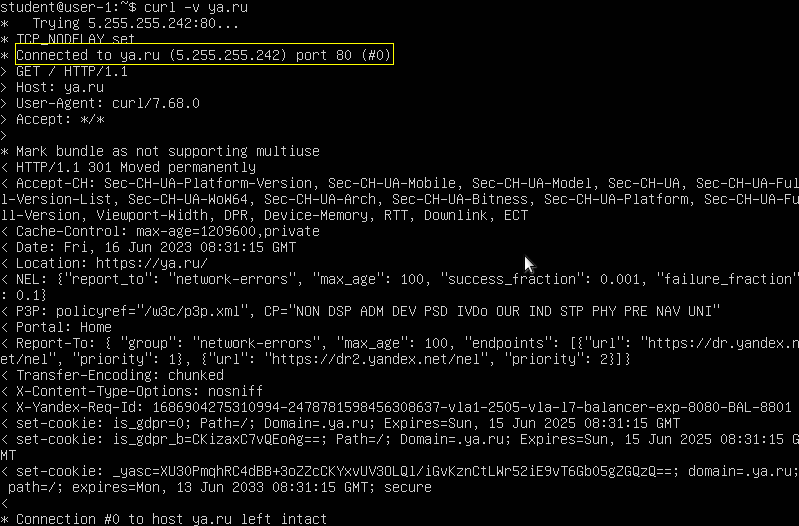
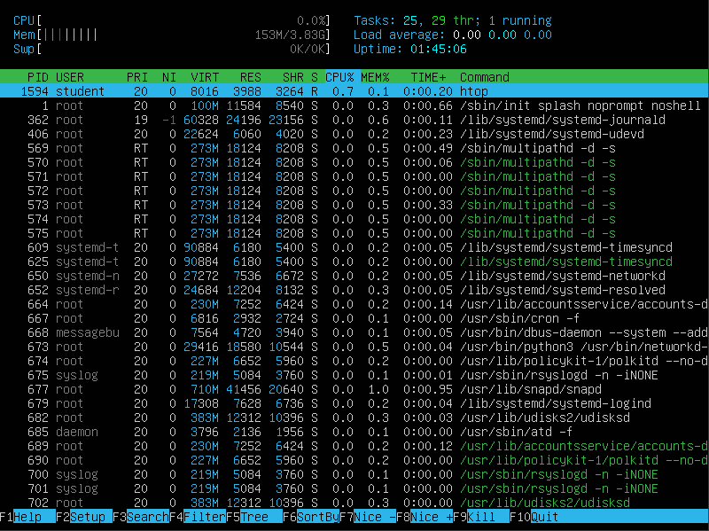
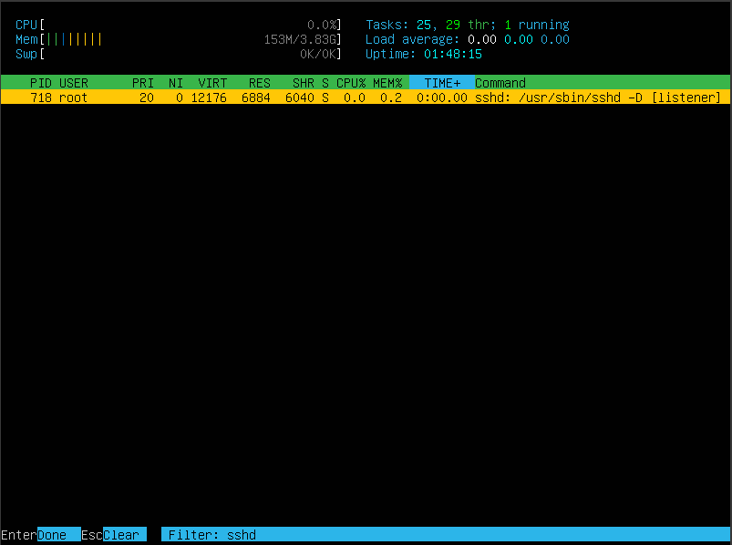
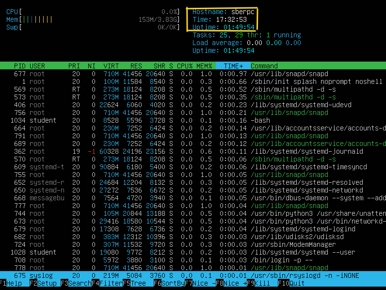

# Операционные системы UNIX/Linux (Базовый).

Установка и обновления системы Linux. Основы администрирования.

## Contents
3. [Chapter III](#chapter-iii) \
    3.1 [Установка ОС](#part-1-установка-ос)  
    3.2 [Создание пользователя](#part-2-создание-пользователя)  
    3.3 [Настройка сети ОС](#part-3-настройка-сети-ос)   
    3.4 [Обновление ОС](#part-4-обновление-ос)  
    3.5 [Использование команды  sudo](#part-5-использование-команды-sudo)  
    3.6 [Установка и настройка службы времени](#part-6-установка-и-настройка-службы-времени)  
    3.7 [Установка и использование текстовых редакторов](#part-7-установка-и-использование-текстовых-редакторов)  
    3.8 [Установка и базовая настройка сервиса SSHD](#part-8-установка-и-базовая-настройка-сервиса-sshd)   
    3.9 [Установка и использование утилит top, htop](#part-9-установка-и-использование-утилит-top-htop)   
    3.10 [Использование утилиты fdisk](#part-10-использование-утилиты-fdisk)   
    3.11 [Использование утилиты df](#part-11-использование-утилиты-df)    
    3.12 [Использование утилиты du](#part-12-использование-утилиты-du)    
    3.13 [Установка и использование утилиты ncdu](#part-13-установка-и-использование-утилиты-ncdu)    
    3.14 [Работа с системными журналами](#part-14-работа-с-системными-журналами)     
    3.15 [Использование планировщика заданий CRON](#part-15-использование-планировщика-заданий-cron)    

## Chapter III

## Part 1. Установка ОС

**== Задание ==**

#### **Установить **Ubuntu 20.04 Server LTS** без графического интерфейса. (Используем программу для виртуализации - VirtualBox).**

- Устанавливаем VirtualBox.
- Качаем образ **Ubuntu 20.04 Server LTS**.
- Следуем шагам установки, определив пользователя системы и пароль.
- Перезагружаем виртуальную машину.
- Узнайте версию Ubuntu, выполнив команду `cat /etc/issue.`

*Два способа, как узнать версию Linux*

#
## Part 2. Создание пользователя

**== Задание ==**

#### **Создать пользователя, отличного от пользователя, который создавался при установке. Пользователь должен быть добавлен в группу `adm`.**

- Для создания пользователя воспользуемся командой `useradd`.
- После чего необходимо установить пароль пользователю командой `passwd`. В противном случае пользователь не сможет залогиниться в систему.
- Посмотреть всех пользователей системы можно в файле `/etc/passwd`

*Создание пользователя одновременно с добавлением в группу adm.*

#
## Part 3. Настройка сети ОС

**== Задание ==**

#### **Задать название машины вида user-1.**

- Для изменения имени хоста воспользуемся утилитой `hostnamectl set-hostname [name]`
- Так же необходимо подправить файл `/etc/hosts` для корректного разрешения имен.

*Изменение hostname с помощью утилиты hostnamectl.*

*Исправление файла /etc/hosts.*

#
#### **Установить временную зону, соответствующую вашему текущему местоположению.**

- Для изменения временной зоны воспользуемся утилитой `timedatectl set-timezone [TZ]`

*Изменение временной зоны с помощью утилиты timedatectl.*

#
#### **Вывести названия сетевых интерфейсов с помощью консольной команды.**

- Для отображения всех сетевых интерфейсов воспользумся командой `ip a`

*Просмотр сетевых интерфейсов.*

- В отчёте дать объяснение наличию интерфейса lo.  
##### Интерфейс loopback это виртуальный интерфейс, в буквальном смысле переводится как "обратная петля". В первую очередь используется для тестирования в целом работы стека протокола TCP/IP на локальной машине. Выполнив ping 127.0.0.1 мы можем понять, работает сетевые службы или нет. Так же этот интерфейс используется для отладки сетевых программ и запуска серверных приложений на локальной машине. Так как любые пакеты, отправленные на этот интерфейс, сразу же будут перенаправлены обратно отправителю. Многие сетевые службы и сервисы, в том числе веб-серверы, СУБД как правило настраиваются на прослушивание именно на интерфейсе loopback. Это позволяет локальным сервисам и приложениям обращаться к этим службам, без необходимости использования физических сетевых интерфейсов.

#
#### **Используя консольную команду получить ip адрес устройства, на котором вы работаете, от DHCP сервера.**

- Если IP адрес уже получен от DHCP сервера, то сначала его нужно освободить(release)
с помощью команды `sudo dhclient -r`.
- После чего можно получить новый IP адрес `sudo dhclient [INTERFACE]`

*Получение IP-адреса от DHCP сервера.*

- В отчёте дать расшифровку DHCP.  

##### DHCP - Dynamic Host Configuration Protocol(Протокол динамического конфигурирования хостов). Используется для централизованного и автоматического управления сетевыми настройками хостов сети. 
##### Основные функции DHCP:
- ##### Автоматическое получение и присвоение IP-адресов в локальной сети.
- ##### Централизованное управление сетевыми настройками: администратор может настроить диапазон выделяемых IP-адресов, шлюз по умолчанию, DNS-серверы. Все эти настройки будут автоматически применяться на всех хостах сети.

#
#### **Определить и вывести на экран внешний ip-адрес шлюза (ip) и внутренний IP-адрес шлюза, он же ip-адрес по умолчанию (gw).**

- Для того чтобы вывести внешний ip-адрес шлюза, т.е. IP-адрес который находится фактически у провайдера, воспользуемся сторонним сервисом `eth.me`
- Для просмотра шлюза по-умолчанию воспользуемся командоё `ip route`

*Просмотр IP-адреса внешнего шлюза и внутреннего (default gateway).*

#
#### **Задать статичные (заданные вручную, а не полученные от DHCP сервера) настройки ip, gw, dns (использовать публичный DNS серверы, например 1.1.1.1 или 8.8.8.8).**

- Для того, чтобы задать статические перманентные(постоянные) IP-адрес, шлюз по-умолчанию и DNS сервера воспользуемся утилитой `netplan`.
- Сперва подправим существующий конфигурационный файл `/etc/netplan/*.yaml`.

*Настройки до применения статики.*

*Изменение конфигурационного файла netplan.*
#
#### **Перезагрузить виртуальную машину. Убедиться, что статичные сетевые настройки (ip, gw, dns) соответствуют заданным в предыдущем пункте.**

*Проверка настроек после перезагрузки хоста.*

#
#### **Успешно пропинговать удаленные хосты 1.1.1.1 и ya.ru и вставить в отчёт скрин с выводом команды. В выводе команды должна быть фраза "0% packet loss".**

*Проверка доступности сервера ya.ru с помощью curl.*

*Проверка доступности сервера 1.1.1.1 с помощью ping.*

#
## Part 4. Обновление ОС

**== Задание ==**

#### **Обновить системные пакеты до последней на момент выполнения задания версии.**

- Для обновления системных пакетов необходимо ввести последовательно две команды \
`sudo apt update && sudo apt upgrade`

*Обновление системных пакетов.*

*Обновление системных пакетов.*

*Обновление завершено.*

#
## Part 5. Использование команды **sudo**

**== Задание ==**

#### **Разрешить пользователю, созданному в [Part 2](#part-2-создание-пользователя), выполнять команду sudo.**

*Добавление прав sudo пользователю.*

##### Команда sudo используется для выполнения команд с правами супервользователя (Superuser, root). Основное назначение команды sudo состоит в том, чтобы предоставить временный доступ и возможности администрирования для выполнения задач, требующих повышенных привилегий, без необходимости постоянного входа в систему от имени суперпользователя. Этот способ по мнению Canonical является более безопасным и предпочтительным.

#
#### **Поменять hostname ОС от имени пользователя, созданного в пункте [Part 2](#part-2-создание-пользователя) (используя sudo).**
#

- Для выполнения команды от имени другого пользователя можно воспользоваться утилитой `sudo -l [USER] [COMMAND]`. Стоит отметить однако, что команда будет выполнена с правами пользователя USER, но не суперпользователя. 

*Изменение имени хоста от имени товарища verter.*

#
## Part 6. Установка и настройка службы времени

**== Задание ==**

#### **Настроить службу автоматической синхронизации времени.**

#### **Вывести время, часового пояса, в котором вы сейчас находитесь.Вывод следующей команды `timedatectl show` должен содержать `NTPSynchronized=yes`**

- Для настройки службы автоматической синхронизации времени в Ubuntu существует утилита `timesyncd`.
- По-умолчанию синхронизация с помощью этого сервиса включена. Для включения вручную необходимо ввести команду `sudo timedatectl set-ntp on`

*Текущее время и часовой пояс.*

#
## Part 7. Установка и использование текстовых редакторов 

**== Задание ==**

#### **Установить текстовые редакторы **VIM** (+ любые два по желанию **NANO**, **MCEDIT**, **JOE** и т.д.)**

- Установим редактор joe `sudo apt install joe`

#### **Используя каждый из трех выбранных редакторов, создайте файл *test_X.txt*, где X -- название редактора, в котором создан файл. Напишите в нём свой никнейм, закройте файл с сохранением изменений.**

*Работа в vi.*

*Работа в nano.*

*Работа в joe.*

- Vi: режим редактирования запускается клавишей `i`, для сохранения необходимо вернуться в режим команд `Esc, ^-C, ^-]`, после чего ввести команду сохранения и выхода из редактора `:wq, :x`.
- Nano: редактор сразу находится в режиме редактирования. Для сохранения необходимо нажать `^-O + Enter`, для выхода `^-X`.
- Joe: для начала редактирования нажать `^-K + i`, для выхода `^-K + x`.

#
#### **Используя каждый из трех выбранных редакторов, откройте файл на редактирование, отредактируйте файл, заменив никнейм на строку "21 School 21", закройте файл без сохранения изменений.**

*Работа в vi.*

*Работа в nano.*

*Работа в joe.*

- Vi: для выхода из редактора без сохранения `:q!`.
- Nano: для выхода без сохранения `^-X` и `N`.
- Joe: для выхода `^-K + Q` и `N`.

#
#### **Используя каждый из трех выбранных редакторов, отредактируйте файл ещё раз (по аналогии с предыдущим пунктом), а затем освойте функции поиска по содержимому файла (слово) и замены слова на любое другое.**

*Работа в vi.*

*Работа в nano.*

*Работа в joe.*

- Vi: для поиска слова в командном режиме необходимо нажать `/word`. Для глобальной замены во всем файле в командном режиме ввести `:%s/word/new_word/g`.
- Nano: для выхода без сохранения `^-W` и ввести слово. Для поиска и замены Alt-R, ввести слово, ввести слово для замены и нажать A для замены всех вхождений в файле.
- Joe: для поиска `^-K + F` и `слово`. Для замены `r`.

#
## Part 8. Установка и базовая настройка сервиса **SSHD**

**== Задание ==**

#### **Установить службу SSHd.**

- Для установки службы SSH необходимо ввести команду `sudo apt install openssh-service`.

*Установка службы SSH.*

#
#### **Добавить автостарт службы при загрузке системы.**

- По-умолчанию автозагрузка службы SSH при загрузке системы включена. В противном случае автостарт добавляется командой `sudo systemctl enable ssh`.

*Статус службы SSH.*

#
#### **Перенастроить службу SSHd на порт 2022.**

- Для изменения listen-порта сервиса SSH, воспользуемся `vi /etc/ssh/sshd_config/`

*Смена порта службы SSH.*

*Смена порта службы SSH.*

#
#### **Используя команду ps, показать наличие процесса sshd. Для этого к команде нужно подобрать ключи.**

- Для поиска службы SSH в процессах системы исползуем команду `ps -ef | grep sshd`. Ключ -e выводит все процессы, -f выводит всю информацию о процессах.

*Поиск службы SSH во всех процессах системы.*

#
#### Перезагрузить систему.

- Перезагрузка системы выполняется командой `sudo reboot` или `sudo shutdown -r now` или `sudo systemctl reboot`

*Перезагрузка системы.*

#
#### **Вывод команды netstat -tan должен содержать `tcp 0 0 0.0.0.0:2022 0.0.0.0:* LISTEN`**

*Команда netstat.*

- Значение столбцов команды `netstat`:
	- Proto: Транспортный протокол используемый сокетом;
	- Recv-q: Количество байтов в очереди на получение сервисом.
	- Send-q: Количество байтов, готовых к отправке сервисом, находящихся в очереди.
	- Local address: указывается локальный адрес хоста:порт. 
	- Foreign address: удаленный адрес:порт соединения.
	- State: состояние сессии. Как правило для UDP протокола - пустое значение. 

- Ключи команды `netstat`:
	- -t - отображать только TCP порты;
	- -a - отображать все сетевые соединения и порты, включая слушающие и активные;
	- -n - отображать порты в числовом формате, вместо преобразовани в имена сервисов (http, ssh);

#
## Part 9. Установка и использование утилит **top**, **htop**

**== Задание ==**

#### **Установить и запустить утилиты top и htop.**

*Команда top.*

- По выводу команды top определить и написать в отчёте:
  - uptime - 1 час 19 мин.
  - количество авторизованных пользователей - 1
  - общую загрузку системы - 0.00
  - общее количество процессов - 93
  - загрузку cpu - 0.0
  - загрузку памяти - всего 3920 Мб, свободно 3279.5 Мб.
  - pid процесса занимающего больше всего памяти - `SHIFT+M` snapd 1.0% памяти.
  - pid процесса, занимающего больше всего процессорного времени - `SHIFT+P` top 1.5% cpu.

- Вывод команд htop:

*Команда htop.*

*Команда htop.*

*Команда htop.*

  - отсортированному по PID, PERCENT_CPU, PERCENT_MEM, TIME

*Команда htop.*

  - отфильтрованному для процесса sshd

*Команда htop.*

  - с процессом syslog, найденным, используя поиск 

*Команда htop.*

  - с добавленным выводом hostname, clock и uptime  

*Команда htop.*

#
## Part 10. Использование утилиты **fdisk**

**== Задание ==**

#### **Запустить команду fdisk -l.**

*Команда fdisk.*

- В отчёте написать название жесткого диска - `/dev/sda`, его размер - `20 Gib` и количество секторов - `41943040`, а также размер swap - раздел на этом диске отсутствует.

#
## Part 11. Использование утилиты **df** 

**== Задание ==**

#### **Запустить команду df.**

*Команда df.*

- В отчёте написать для корневого раздела (/):
  - размер раздела - `10218772`
  - размер занятого пространства - `3099120`
  - размер свободного пространства - `6578980`
  - процент использования - `33%`
- Определить и написать в отчёт единицу измерения в выводе - `1Kb`.

#
#### **Запустить команду df -Th.**

*Команда df.*

- В отчёте написать для корневого раздела (/):
    - размер раздела - `9.8G`
    - размер занятого пространства - `3.0G`
    - размер свободного пространства - `6.3G`
    - процент использования - `33%`
- Определить и написать в отчёт тип файловой системы для раздела - `1Gb`.

#
## Part 12. Использование утилиты **du**

**== Задание ==**

#### **Запустить команду du.**

*Команда du.*

#
#### **Вывести размер папок /home, /var, /var/log (в байтах, в человекочитаемом виде)**

*Команда du.*

*Команда du.*

*Команда du.*

#
#### **Вывести размер всего содержимого в /var/log (не общее, а каждого вложенного элемента, используя *)**

*Команда du.*

#
## Part 13. Установка и использование утилиты **ncdu**

**== Задание ==**

#### **Установить утилиту ncdu.**

*Команда ncdu.*

#
#### **Вывести размер папок /home, /var, /var/log.**

*Команда ncdu.*

*Команда ncdu.*

*Команда ncdu.*

- Размеры должны примерно совпадать с полученными в [Part 12](#part-12-использование-утилиты-du).

#
## Part 14. Работа с системными журналами

**== Задание ==**

#### **Открыть для просмотра:**

*Просмотр логов /var/log/dmesg.*

#
#### **1. /var/log/dmesg**

*Просмотр логов /var/log/syslog.*

#
#### **2. /var/log/syslog**

*Просмотр логов /var/log/auth.log.*

#
#### **3. /var/log/auth.log**

*Успешная авторизация.*

- Написать в отчёте время последней успешной авторизации - `9:22`, имя пользователя - `student` и метод входа в систему - `LOGIN`.
- Перезапустить службу SSHd.

*Сообщение о перезапуске SSHd.*

#
## Part 15. Использование планировщика заданий **CRON**

**== Задание ==**

#### **Используя планировщик заданий, запустите команду uptime через каждые 2 минуты.**

- Используем команду `crontab -e`

*Настройка cron.*

- Найти в системных журналах строчки (минимум две в заданном временном диапазоне) о выполнении.

*Записи в системном журнале.*

- Вывести на экран список текущих заданий для CRON.

*Список текущих заданий CRON.*

#
#### **Удалите все задания из планировщика заданий.**

- Для удаление все заданий из CRON `crontab -r`

*Список текущих заданий CRON.*
