# Сети в Linux

Настройка сетей в Linux на виртуальных машинах.

## Contents

3. [Chapter III](#chapter-iii) \
   3.1. [Инструмент ipcalc](#part-1-инструмент-ipcalc) \
   3.2. [Статическая маршрутизация между двумя машинами](#part-2-статическая-маршрутизация-между-двумя-машинами) \
   3.3. [Утилита iperf3](#part-3-утилита-iperf3) \
   3.4. [Сетевой экран](#part-4-сетевой-экран) \
   3.5. [Статическая маршрутизация сети](#part-5-статическая-маршрутизация-сети) \
   3.6. [Динамическая настройка IP с помощью DHCP](#part-6-динамическая-настройка-ip-с-помощью-dhcp) \
   3.7. [NAT](#part-7-nat) \
   3.8. [Допополнительно. Знакомство с SSH Tunnels](#part-8-дополнительно-знакомство-с-ssh-tunnels)
4. [Chapter IV](#chapter-iv)

## Chapter III

В качестве результата работы должен быть предоставлен отчет по выполненным задачам. В каждой части задания указано, что должно быть помещено в отчёт, после её выполнения. Это могут быть ответы на вопросы, скриншоты и т.д.
- В репозиторий, в папку src, должен быть загружен отчёт с расширением .md.
- В отчёте должны быть выделены все части задания, как заголовки 2-го уровня.
- В рамках одной части задания всё, что помещается в отчёт, должно быть оформлено в виде списка.
- Каждый скриншот в отчёте должен быть кратко подписан (что показано на скриншоте).
- Все скриншоты обрезаны так, чтобы была видна только нужная часть экрана.
- На одном скриншоте допускается отображение сразу нескольких пунктов задания, но они все должны быть описаны в подписи к скриншоту.
- На все виртуальные машины, созданные в процессе выполнения задания, устанавливать **Ubuntu 20.04 Server LTS**

## Part 1. Инструмент **ipcalc**

**== Задание ==**

#### **Поднять виртуальную машину (далее -- ws1)**

### **1.1. Сети и маски**
#### Определить и записать в отчёт:
#### 1) адрес сети *192.167.38.54/13 - 192.160.0.0/13

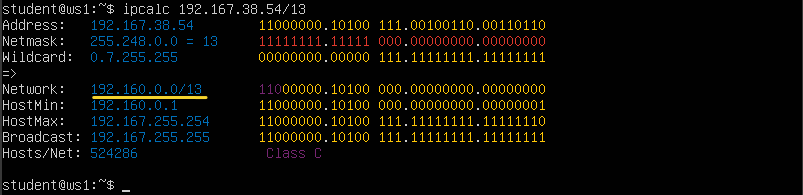

*Адрес сети для хоста 192.167.38.54/13.*

#
#### 2) перевод маски *255.255.255.0* в префиксную и двоичную запись, */15* в обычную и двоичную, *11111111.11111111.11111111.11110000* в обычную и префиксную

- 255.255.255.0 = /24 = 11111111.11111111.11111111
- /15 = 255.254.0.0 = 11111111.11111110.00000000.00000000
- 11111111.11111111.11111111.11110000 = 255.255.255.240 = /28

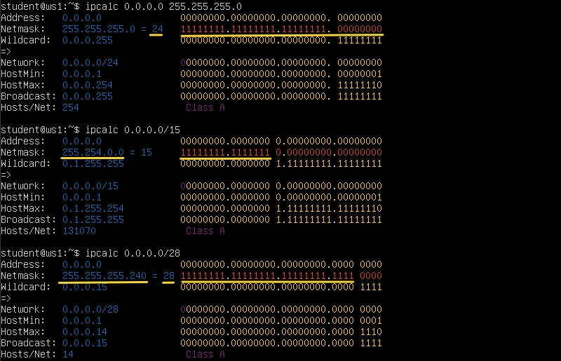

*Маски подсетей.*

#
#### 3) минимальный и максимальный хост в сети *12.167.38.4* при масках: */8*, *11111111.11111111.00000000.00000000*, *255.255.254.0* и */4*

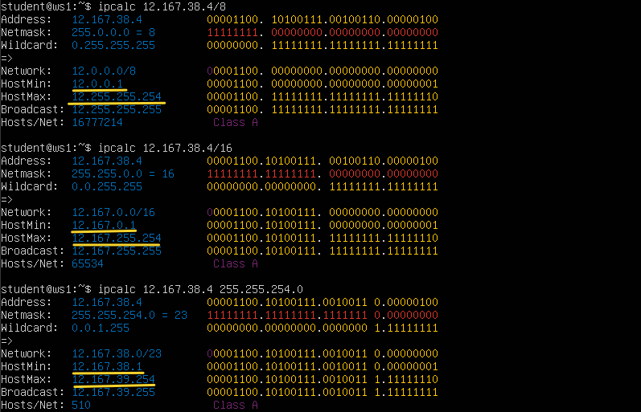
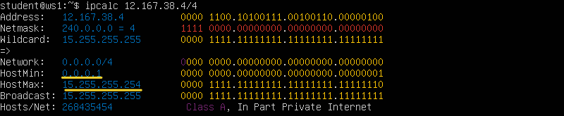

*Минимальный и максимальный хосты.*

#
### **1.2. localhost**
#### Определить и записать в отчёт, можно ли обратиться к приложению, работающему на localhost, со следующими IP: *194.34.23.100*, *127.0.0.2*, *127.1.0.1*, *128.0.0.1*

- В соответствии с закрепленными приватными адресами для loopback интерфейсов выделена подсеть `127.0.0.0/8`. Таким образом следующие IP позволяют обратиться к приложению на localhost: `127.1.0.1, 127.0.0.2`. IP-адреса `194.34.23.100 и 128.0.0.1` не принадлежат к диапазону loopback интерфейсов. Для подтверждения воспользуемся `ipcalc [IP]/8`.

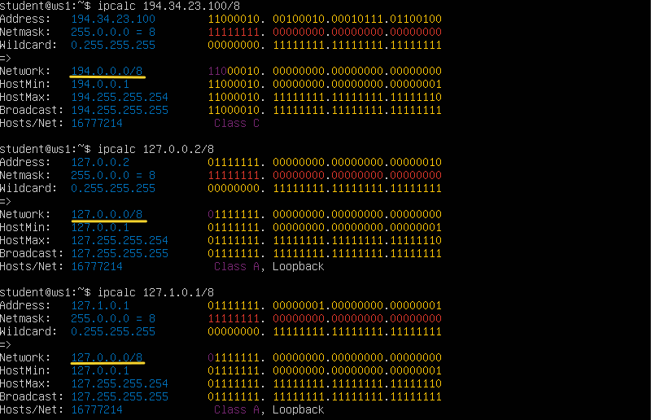
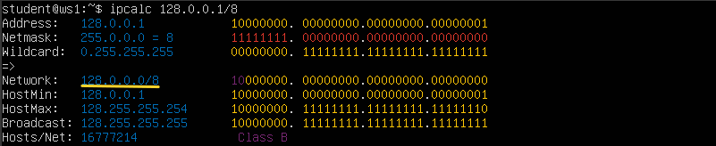

*loopback сеть.*

#
### **1.3. Диапазоны и сегменты сетей**
#### Определить и записать в отчёт:
#### 1) какие из перечисленных IP можно использовать в качестве публичного, а какие только в качестве частных: *10.0.0.45*, *134.43.0.2*, *192.168.4.2*, *172.20.250.4*, *172.0.2.1*, *192.172.0.1*, *172.68.0.2*, *172.16.255.255*, *10.10.10.10*, *192.169.168.1*

- Частные сети:
	- 10.0.0.0/8: `10.0.0.45, 10.10.10.10;`
	- 172.16.0.0/12: `172.20.250.4, 172.16.255.255`;
	- 192.168.0.0/16: `192.168.4.2`;
- Публичные адреса: 
	- `134.43.0.2, 172.0.2.1, 192.172.0.1, 172.68.0.2, 192.169.168.1`.

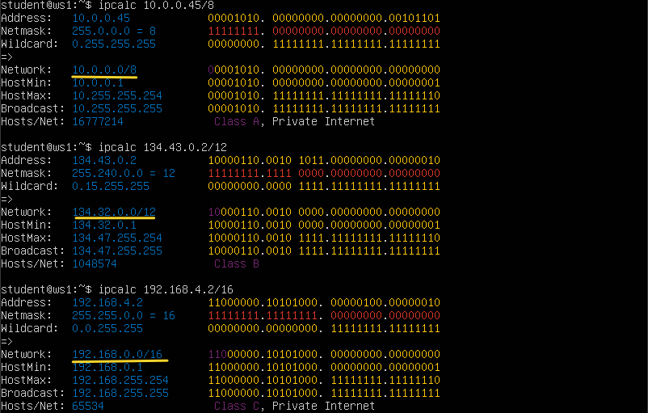
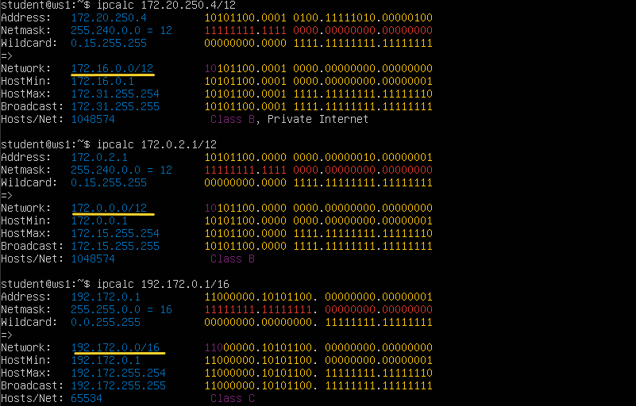


*Приватные и публичные IP-адреса.*

#### 2) какие из перечисленных IP адресов шлюза возможны у сети *10.10.0.0/18*: *10.0.0.1*, *10.10.0.2*, *10.10.10.10*, *10.10.100.1*, *10.10.1.255*

- Определим все доступные IP-адреса хостов этой сети: `10.10.0.1 - 10.10.63.254`. Таким образом шлюзом могут быть следующие адреса: 
	- `10.10.0.2, 10.10.10.10, 10.10.1.255`;

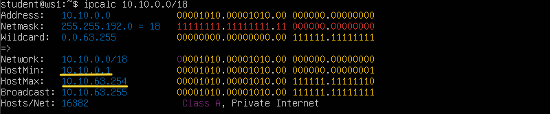

*Шлюзы сети.*

#
## Part 2. Статическая маршрутизация между двумя машинами

`-` Теперь разберёмся, как связать две машины, используя статическую маршрутизацию.

**== Задание ==**

#### **Поднять две виртуальные машины (далее -- ws1 и ws2)**

#### **С помощью команды `ip a` посмотреть существующие сетевые интерфейсы**


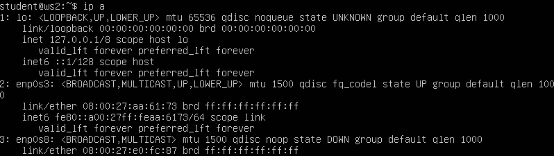

*IP адреса до настройки.*

#
#### **Описать сетевой интерфейс, соответствующий внутренней сети, на обеих машинах и задать следующие адреса и маски: ws1 - *192.168.100.10*, маска */16*, ws2 - *172.24.116.8*, маска */12*
- В отчёт поместить скрины с содержанием изменённого файла *etc/netplan/00-installer-config.yaml* для каждой машины.


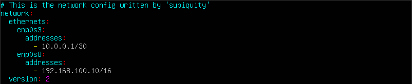
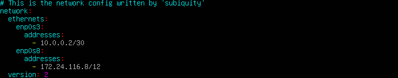

*Настраиваем IP адреса для интерфейсов.*

- Для сети между двумя хостами взята внутренняя сеть 10.0.0.0/30.

#
#### **Выполнить команду `netplan apply` для перезапуска сервиса сети**
- В отчёт поместить скрин с вызовом и выводом использованной команды.


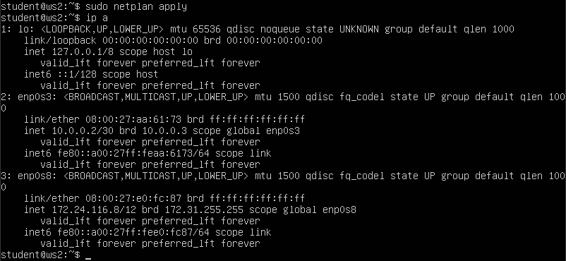

*Применяем netplan.*

#
### **2.1. Добавление статического маршрута вручную**
#### **Добавить статический маршрут от одной машины до другой и обратно при помощи команды вида `ip r add`**
#### **Пропинговать соединение между машинами**
- В отчёт поместить скрин с вызовом и выводом использованных команд.

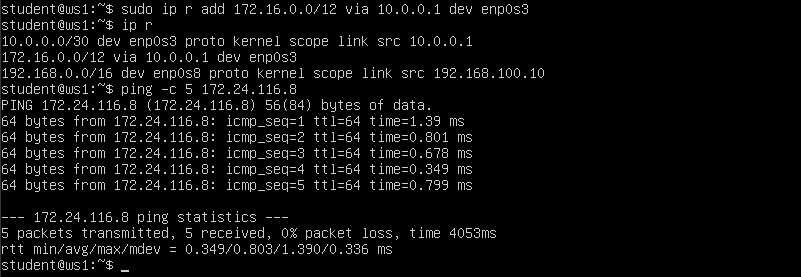
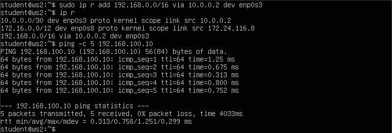

*Статический маршрут(temporary).*

#
### **2.2. Добавление статического маршрута с сохранением**
#### **Перезапустить машины**
#### **Добавить статический маршрут от одной машины до другой с помощью файла *etc/netplan/00-installer-config.yaml***
- В отчёт поместить скрин с содержанием изменённого файла *etc/netplan/00-installer-config.yaml*.


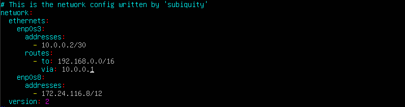

*Статический маршрут(permanent).*

#
#### **Пропинговать соединение между машинами**
- В отчёт поместить скрин с вызовом и выводом использованной команды.

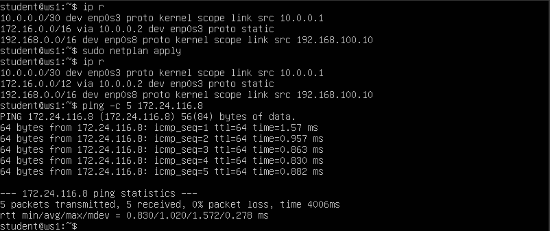
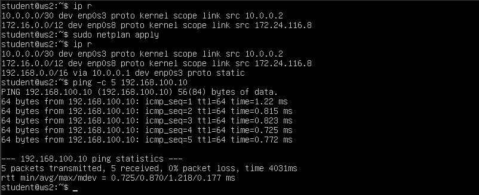

*Статический маршрут(permanent).*

#
## Part 3. Утилита **iperf3**

**== Задание ==**

*В данном задании используются виртуальные машины ws1 и ws2 из Части 2*

### **3.1. Скорость соединения**
#### **Перевести и записать в отчёт: 8 Mbps в MB/s, 100 MB/s в Kbps, 1 Gbps в Mbps**

- 8 Mbps = 1 MB/s;
- 100 MB/s = 800,000 Kbps;
- 1Gbps = 1000 Mbps;

### **3.2. Утилита iperf3**
#### Измерить скорость соединения между ws1 и ws2
- В отчёт поместить скрины с вызовом и выводом использованных команд.

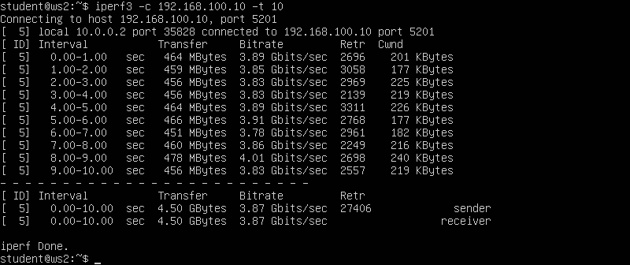
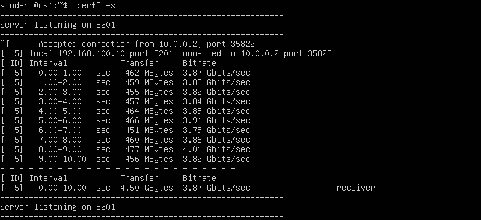

*Iperf3 в деле*

## Part 4. Сетевой экран

**== Задание ==**

*В данном задании используются виртуальные машины ws1 и ws2 из Части 2*

### **4.1. Утилита iptables**
#### **Создать файл */etc/firewall.sh*, имитирующий фаерволл, на ws1 и ws2:**
```shell
#!/bin/sh

# Удаление всех правил в таблице "filter" (по-умолчанию).
iptables –F
iptables -X
```
#### Нужно добавить в файл подряд следующие правила:
#### 1) на ws1 применить стратегию когда в начале пишется запрещающее правило, а в конце пишется разрешающее правило (это касается пунктов 4 и 5)
#### 2) на ws2 применить стратегию когда в начале пишется разрешающее правило, а в конце пишется запрещающее правило (это касается пунктов 4 и 5)
#### 3) открыть на машинах доступ для порта 22 (ssh) и порта 80 (http)
#### 4) запретить *echo reply* (машина не должна "пинговаться”, т.е. должна быть блокировка на OUTPUT)
#### 5) разрешить *echo reply* (машина должна "пинговаться")
- В отчёт поместить скрины с содержанием файла */etc/firewall* для каждой машины.

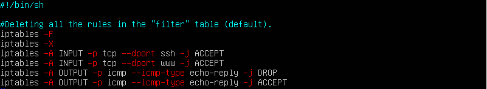
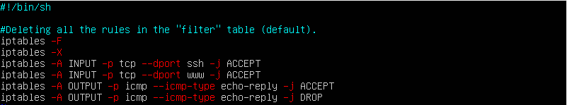

*firewall.sh*

#
#### Запустить файлы на обеих машинах командами `chmod +x /etc/firewall.sh` и `/etc/firewall.sh`
- В отчёт поместить скрины с запуском обоих файлов.

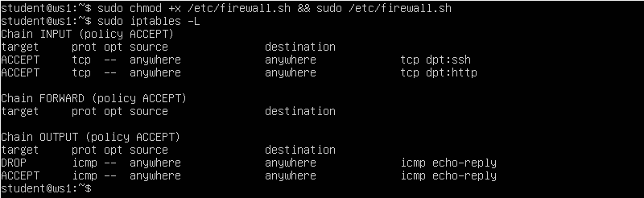


*Применение команд и просмотр iptables*

- В отчёте описать разницу между стратегиями, применёнными в первом и втором файлах.

- На хосте ws1 мы описали запрещающее правило для протокола icmp перед разрешающим, таким образом мы запретили прохождение icmp-ответов с хоста. Так как это правило находится выше, то при его срабатывании, правила находящиеся ниже уже не будут проверяться (по сути дела последнее правило можно удалить). 
- На хосте ws2 ситуация диаметрально противоположная, таким образом icmp-reply с этого хоста будут уходить. Последнее запрещающее правило не будет срабатывать.

### **4.2. Утилита nmap**
#### **Командой `ping` найти машину, которая не "пингуется", после чего утилитой `nmap` показать, что хост машины запущен**
*Проверка: в выводе nmap должно быть сказано: `Host is up`*
- В отчёт поместить скрины с вызовом и выводом использованных команд **ping** и **nmap**.

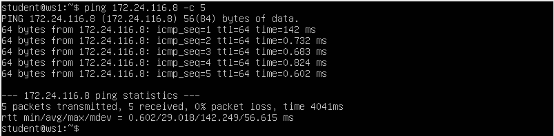


*ping && nmap*

#### **Сохранить дампы образов виртуальных машин**
**p.s. Ни в коем случае не сохранять дампы в гит!**

#
## Part 5. Статическая маршрутизация сети

**== Задание ==**

Сеть: \


#### **Поднять пять виртуальных машин (3 рабочие станции (ws11, ws21, ws22) и 2 роутера (r1, r2))**

### **5.1. Настройка адресов машин**
#### **Настроить конфигурации машин в *etc/netplan/00-installer-config.yaml* согласно сети на рисунке.**
- В отчёт поместить скрины с содержанием файла *etc/netplan/00-installer-config.yaml* для каждой машины.

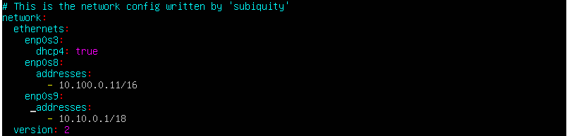
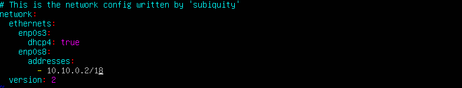
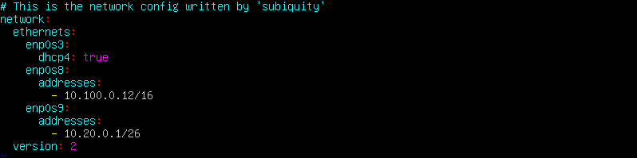
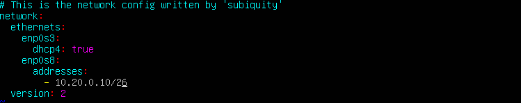
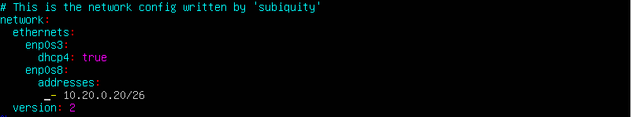

*IP configs*

#
#### **Перезапустить сервис сети. Если ошибок нет, то командой `ip -4 a` проверить, что адрес машины задан верно. Также пропинговать ws22 с ws21. Аналогично пропинговать r1 с ws11.**
- В отчёт поместить скрины с вызовом и выводом использованных команд.


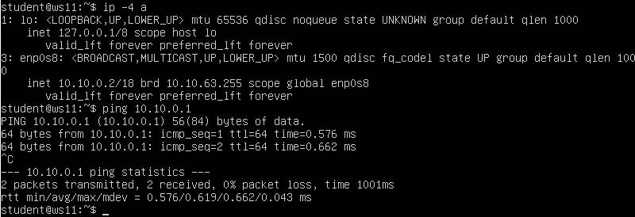
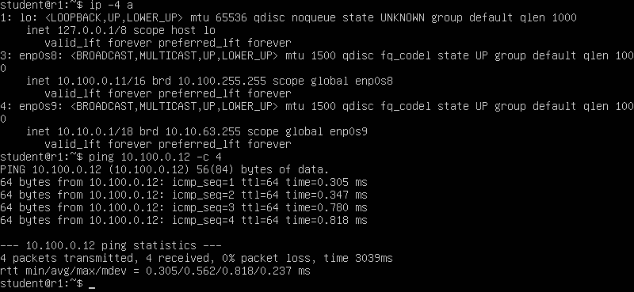
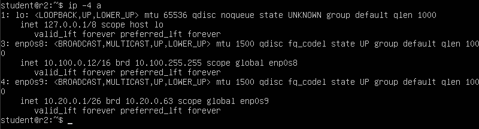
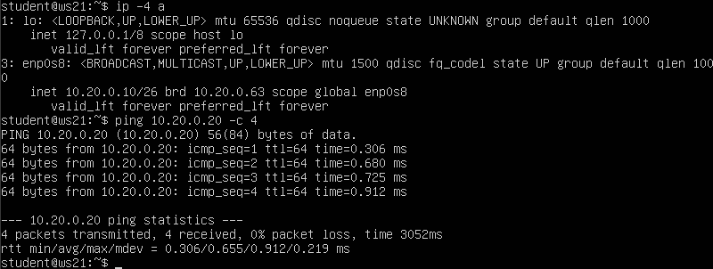
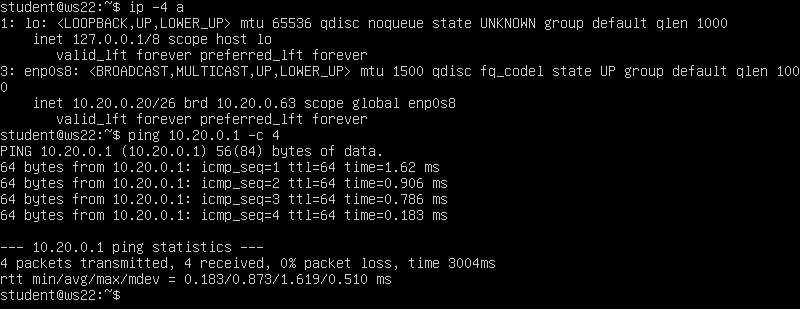

*Проверка настроек и ping*

#
### **5.2. Включение переадресации IP-адресов.**
#### **Для включения переадресации IP, выполните команду на роутерах:**
`sysctl -w net.ipv4.ip_forward=1`

При таком подходе переадресация не будет работать после перезагрузки системы.

- В отчёт поместить скрин с вызовом и выводом использованной команды.


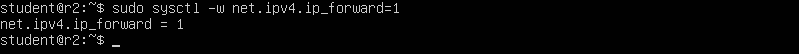

*Настройка маршрутизации*

#
#### **Откройте файл */etc/sysctl.conf* и добавьте в него следующую строку:**
`net.ipv4.ip_forward = 1`

При использовании этого подхода, IP-переадресация включена на постоянной основе.

- В отчёт поместить скрин с содержанием изменённого файла */etc/sysctl.conf*.

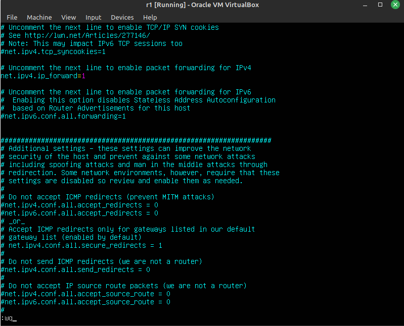
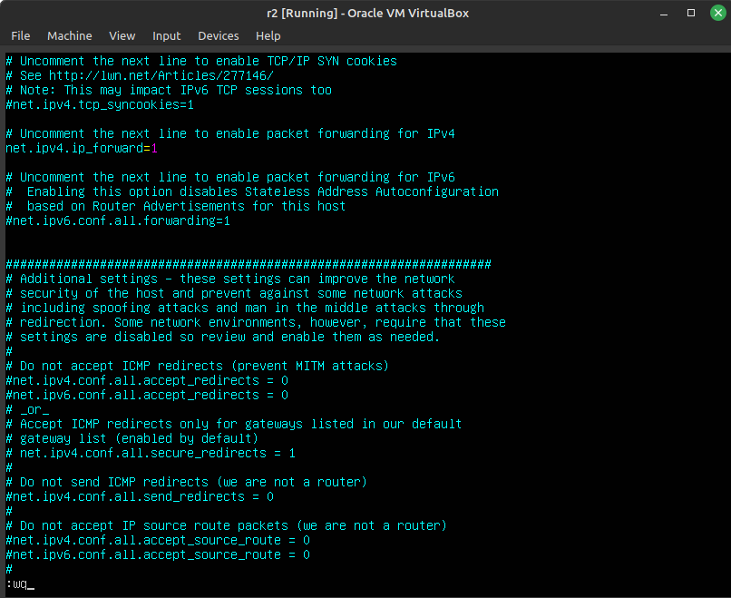

*Настройка маршрутизации(permanent)*

#
### **5.3. Установка маршрута по-умолчанию**
Пример вывода команды `ip r` после добавления шлюза:
```
default via 10.10.0.1 dev eth0
10.10.0.0/18 dev eth0 proto kernel scope link src 10.10.0.2
```
#### **Настроить маршрут по-умолчанию (шлюз) для рабочих станций. Для этого добавить `default` перед IP роутера в файле конфигураций**

- В отчёт поместить скрин с содержанием файла *etc/netplan/00-installer-config.yaml*.

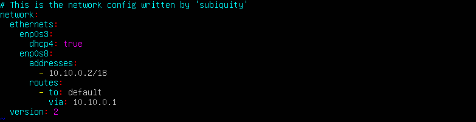
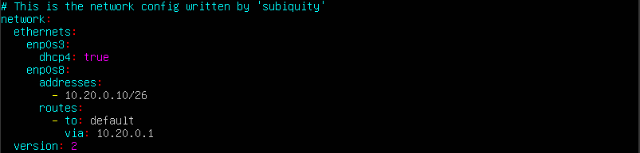
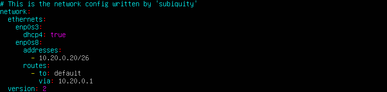

*Настройка маршрута по-умолчанию*

#
#### **Вызвать `ip r` и показать, что добавился маршрут в таблицу маршрутизации**

- В отчёт поместить скрин с вызовом и выводом использованной команды.

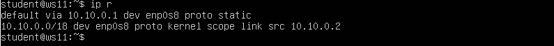
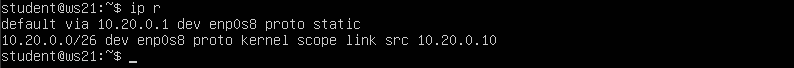
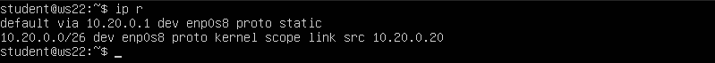

*Настройка маршрута по-умолчанию*

#
#### **Пропинговать с ws11 роутер r2 и показать на r2, что пинг доходит. Для этого использовать команду:**
`tcpdump -tn -i eth1`

- В отчёт поместить скрин с вызовом и выводом использованных команд.

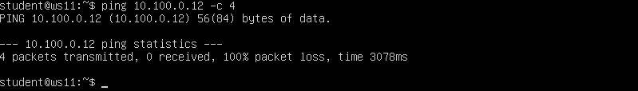
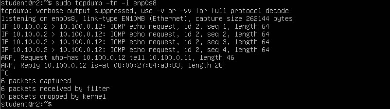

*Проверка наличия маршрутов*

#
### **5.4. Добавление статических маршрутов**
#### **Добавить в роутеры r1 и r2 статические маршруты в файле конфигураций. Пример для r1 маршрута в сетку 10.20.0.0/26:**
```shell
# Добавить в конец описания сетевого интерфейса eth1:
- to: 10.20.0.0
  via: 10.100.0.12
```
- В отчёт поместить скрины с содержанием изменённого файла *etc/netplan/00-installer-config.yaml* для каждого роутера.


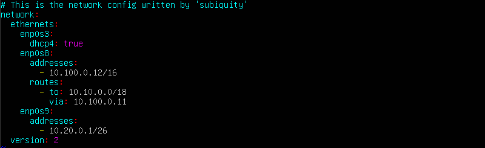

*Статические маршруты*

#### **Вызвать `ip r` и показать таблицы с маршрутами на обоих роутерах. Пример таблицы на r1:**
```
10.100.0.0/16 dev eth1 proto kernel scope link src 10.100.0.11
10.20.0.0/26 via 10.100.0.12 dev eth1
10.10.0.0/18 dev eth0 proto kernel scope link src 10.10.0.1
```
- В отчёт поместить скрин с вызовом и выводом использованной команды.


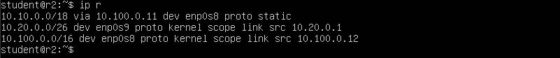

*Таблицы маршрутизации*

#
#### **Запустить команды на ws11:**
`ip r list 10.10.0.0/[маска сети]` и `ip r list 0.0.0.0/0`

- В отчёт поместить скрин с вызовом и выводом использованных команд.

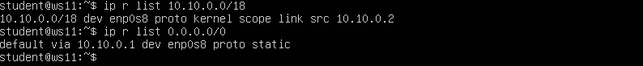

*Таблицы маршрутизации*

- В отчёте объяснить, почему для адреса 10.10.0.0/\[маска сети\] был выбран маршрут, отличный от 0.0.0.0/0, хотя он попадает под маршрут по-умолчанию.

- Не смотря на то, что адрес сети 10.10.0.0/18 попадает под маршрут по-умолчанию, будет выбран маршрут "своей" так же обозначают connected сети потому как маска своей сети "шире" (либо "уже" кому как удобнее, если говорить о размере сети), а значит именно эту сеть нужно добавить в таблицу маршрутизации. По-умолчанию все connected сети добавляются в таблицу маршрутизацию и имеют минимальную метрику 0. Можно еще по-другому представить, что connected сети являются наиболее доверительными в плане получения маршрутной информации.

#
### **5.5. Построение списка маршрутизаторов**
Пример вывода утилиты **traceroute** после добавления шлюза:
```
1 10.10.0.1 0 ms 1 ms 0 ms
2 10.100.0.12 1 ms 0 ms 1 ms
3 10.20.0.10 12 ms 1 ms 3 ms
```
#### **Запустить на r1 команду дампа:**

`tcpdump -tnv -i eth0`

#### **При помощи утилиты **traceroute** построить список маршрутизаторов на пути от ws11 до ws21**
- В отчёт поместить скрины с вызовом и выводом использованных команд (tcpdump и traceroute).

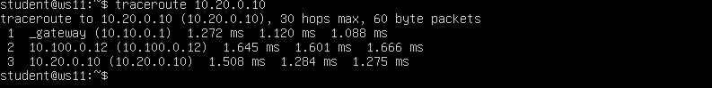
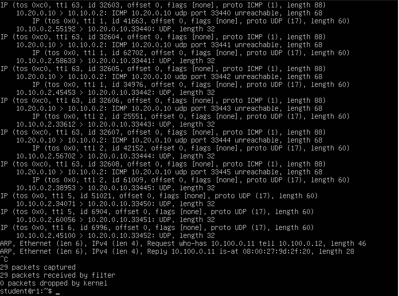

*Traceroute*

- В отчёте, опираясь на вывод, полученный из дампа на r1, объяснить принцип работы построения пути при помощи **traceroute**.

- Утилита traceroute в основе своей работы опирается на довольно простой принцип работы протокола icmp. Первый icmp пакет, отправляемый на шлюз инкапсулируется со значением ttl 0. Первый маршрутизатор(шлюз по-умолчанию) получая этот пакет, в соответствии с основами работы стека TCP/IP обязан вернуть источнику ответ, что необходимый адрес назначения не достижим, т.к. ttl = 0. После получения ответа от первого роутера, traceroute добавляет еще 1 к ttl и опять отправляет пакет в пункт назначения. Любой роутер на пути следования, всегда перед отправкой пакета в исходящий интерфейс убирает 1 от ttl. Таким образом, следующий роутер вернет ответ о недоступности пункта назначения и т.д.

#
### **5.6. Использование протокола **ICMP** при маршрутизации**
#### **Запустить на r1 перехват сетевого трафика, проходящего через eth0 с помощью команды:**
`tcpdump -n -i eth0 icmp`
#### **Пропинговать с ws11 несуществующий IP (например, *10.30.0.111*) с помощью команды:**
`ping -c 1 10.30.0.111`
- В отчёт поместить скрин с вызовом и выводом использованных команд.


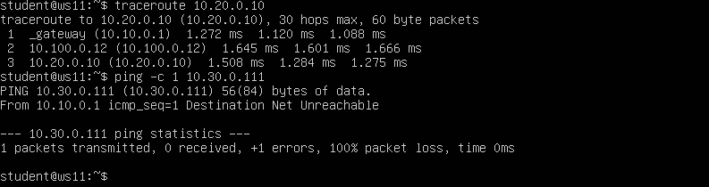

*Отсутствие маршрутов*

#### **Сохранить дампы образов виртуальных машин**
**p.s. Ни в коем случае не сохранять дампы в гит!**

## Part 6. Динамическая настройка IP с помощью **DHCP**

**== Задание ==**

*В данном задании используются виртуальные машины из Части 5*

#### **Для r2 настроить в файле */etc/dhcp/dhcpd.conf* конфигурацию службы **DHCP**:**
#### **1) указать адрес маршрутизатора по-умолчанию, DNS-сервер и адрес внутренней сети. Пример файла для r2:**
```shell
subnet 10.100.0.0 netmask 255.255.0.0 {}

subnet 10.20.0.0 netmask 255.255.255.192
{
    range 10.20.0.2 10.20.0.50;
    option routers 10.20.0.1;
    option domain-name-servers 10.20.0.1;
}
```
#### **2) в файле *resolv.conf* прописать `nameserver 8.8.8.8.`**
- В отчёт поместить скрины с содержанием изменённых файлов.

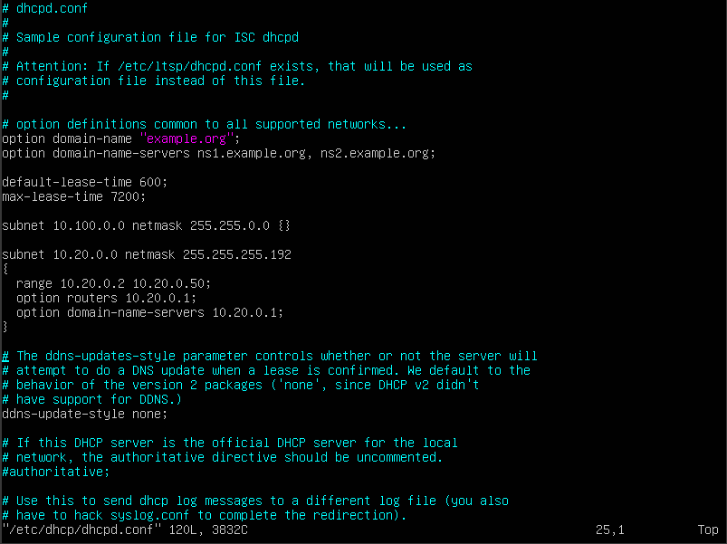
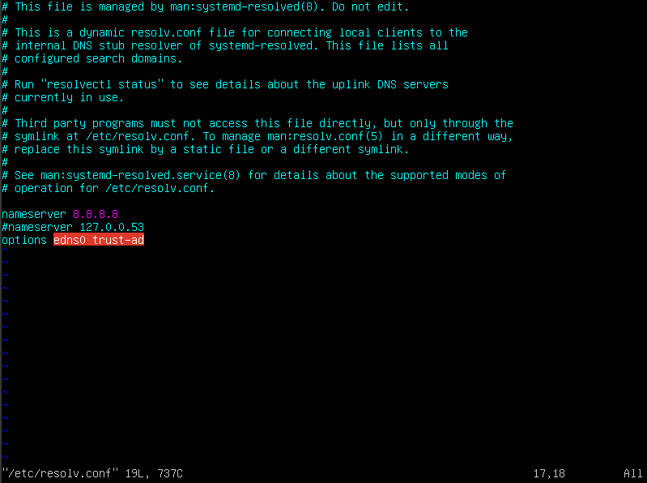

*Настройка dhcp-сервера*

#
#### **Перезагрузить службу **DHCP** командой `systemctl restart isc-dhcp-server`. Машину ws21 перезагрузить при помощи `reboot` и через `ip a` показать, что она получила адрес. Также пропинговать ws22 с ws21.**

- В отчёт поместить скрины с вызовом и выводом использованных команд.


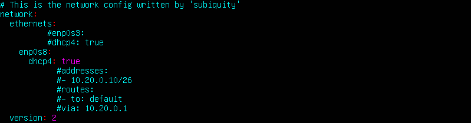
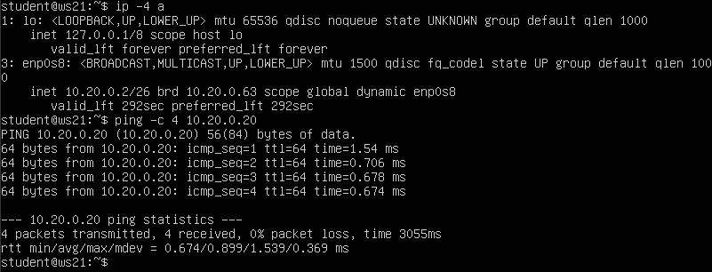

*Перезапуск службы, получение IP адреса и ping.*

#
#### **Указать MAC адрес у ws11, для этого в *etc/netplan/00-installer-config.yaml* надо добавить строки: `macaddress: 10:10:10:10:10:BA`, `dhcp4: true`**

- В отчёт поместить скрин с содержанием изменённого файла *etc/netplan/00-installer-config.yaml*.

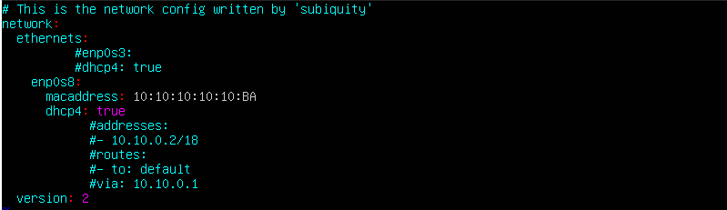

*Настройка ws11.*

#
#### **Для r1 настроить аналогично r2, но сделать выдачу адресов с жесткой привязкой к MAC-адресу (ws11). Провести аналогичные тесты**

- В отчёте этот пункт описать аналогично настройке для r2.

```shell
subnet 10.100.0.0 netmask 255.255.0.0 {}

subnet 10.10.0.0 netmask 255.255.192.0
{
    range 10.10.0.3 10.10.0.50;
    option routers 10.10.0.1;
    option domain-name-servers 10.10.0.1;
    host ws1
      {
        hardware ethernet 10:10:10:10:10:ba;
        fixed-address 10.10.0.2;
      }
}
```

#
#### **Запросить с ws21 обновление ip адреса**

- В отчёте поместить скрины ip до и после обновления.

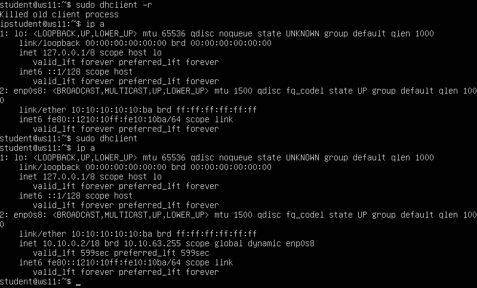

*Получение IP адреса для WS1 после release адреса.*

- В отчёте описать, какими опциями **DHCP** сервера пользовались в данном пункте.

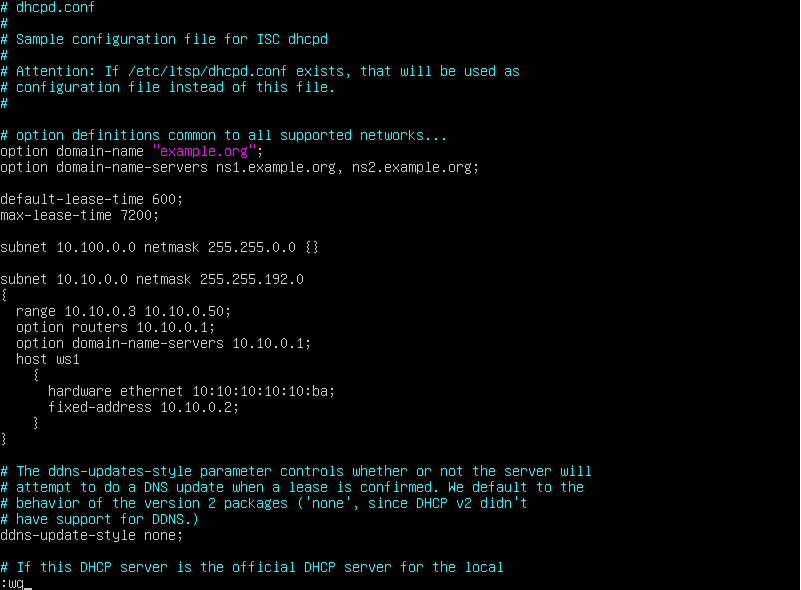
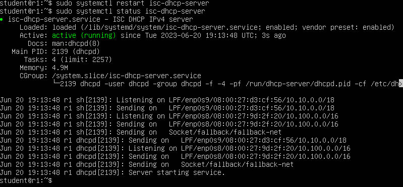

*Опции настройки host ws1.*

#### **Сохранить дампы образов виртуальных машин**
**p.s. Ни в коем случае не сохранять дампы в гит!**

#
## Part 7. **NAT**
`-` Ну и, наконец, в качестве вишенки на торте, я расскажу тебе про механизм преобразования адресов.

**== Задание ==**

*В данном задании используются виртуальные машины из Части 5*
#### **В файле */etc/apache2/ports.conf* на ws22 и r1 изменить строку `Listen 80` на `Listen 0.0.0.0:80`, то есть сделать сервер Apache2 общедоступным**

- В отчёт поместить скрин с содержанием изменённого файла.


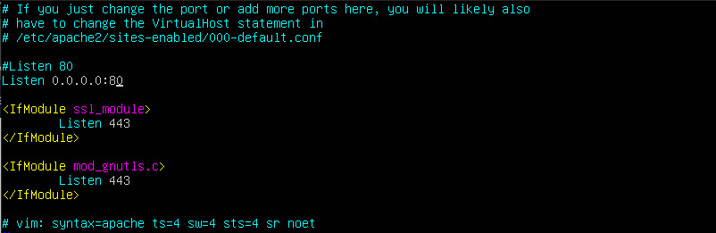

*Подымаем apache2.*

#
#### **Запустить веб-сервер Apache командой `service apache2 start` на ws22 и r1**

- В отчёт поместить скрины с вызовом и выводом использованной команды.

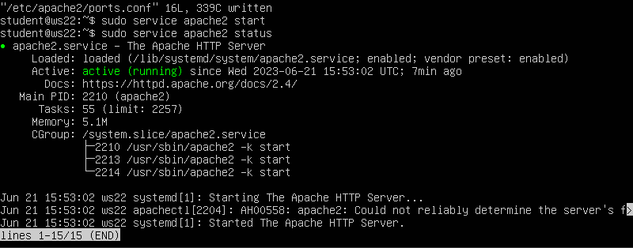
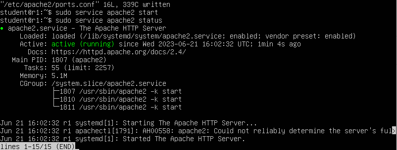

*Подымаем apache2.*

#
#### **Добавить в фаервол, созданный по аналогии с фаерволом из Части 4, на r2 следующие правила:**


#### **1) удаление правил в таблице filter - `iptables -F`**
#### **2) удаление правил в таблице "NAT" - `iptables -F -t nat`**
#### **3) отбрасывать все маршрутизируемые пакеты - `iptables --policy FORWARD DROP`**
#### **Запускать файл также, как в Части 4**
#### **Проверить соединение между ws22 и r1 командой `ping`**

*При запуске файла с этими правилами, ws22 не должна "пинговаться" с r1*

- В отчёт поместить скрины с вызовом и выводом использованной команды.

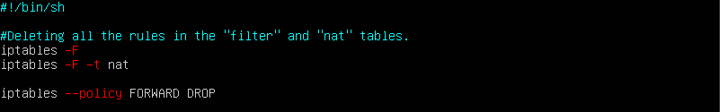
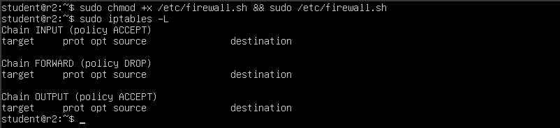
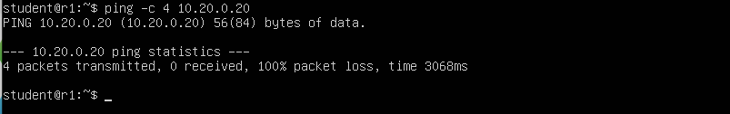

*Первичная настройка firewall.*

#
#### **Добавить в файл ещё одно правило:**
#### **4) разрешить маршрутизацию всех пакетов протокола **ICMP****
#### **Запускать файл также, как в Части 4**
#### **Проверить соединение между ws22 и r1 командой `ping`**

*При запуске файла с этими правилами, ws22 должна "пинговаться" с r1*

- В отчёт поместить скрины с вызовом и выводом использованной команды.

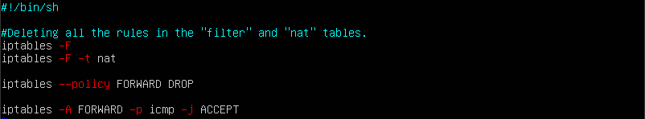
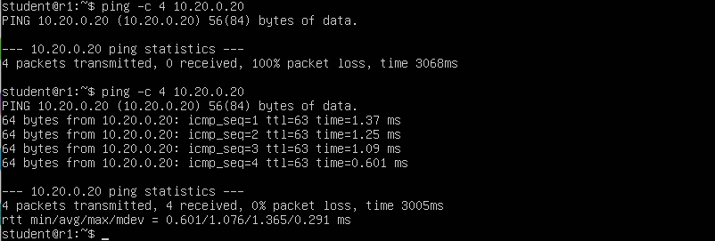

*Разрешаем прохождение icmp firewall.*

#
#### **Добавить в файл ещё два правила:**
#### **5) включить **SNAT**, а именно маскирование всех локальных ip из локальной сети, находящейся за r2 (по обозначениям из Части 5 - сеть 10.20.0.0)**
*Совет: стоит подумать о маршрутизации внутренних пакетов, а также внешних пакетов с установленным соединением*

#### **6) включить **DNAT** на 8080 порт машины r2 и добавить к веб-серверу Apache, запущенному на ws22, доступ извне сети**
*Совет: стоит учесть, что при попытке подключения возникнет новое tcp-соединение, предназначенное ws22 и 80 порту*
- В отчёт поместить скрин с содержанием изменённого файла.


*Настраиваем SNAT и DNAT firewall.*

#
#### **Запускать файл также, как в Части 4**
*Перед тестированием рекомендуется отключить сетевой интерфейс **NAT** (его наличие можно проверить командой `ip a`) в VirtualBox, если он включен*
#### **Проверить соединение по TCP для **SNAT**, для этого с ws22 подключиться к серверу Apache на r1 командой:**

`telnet [адрес] [порт]`
#### **Проверить соединение по TCP для **DNAT**, для этого с r1 подключиться к серверу Apache на ws22 командой `telnet` (обращаться по адресу r2 и порту 8080)**
- В отчёт поместить скрины с вызовом и выводом использованных команд.

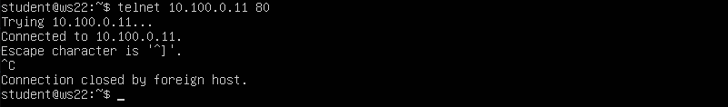
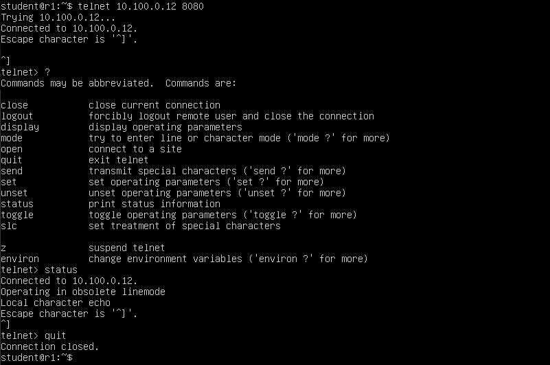

*Проверяем обе настройки SNAT и DNAT.*

#### **Сохранить дампы образов виртуальных машин**
**p.s. Ни в коем случае не сохранять дампы в гит!**

#
## Part 8. Дополнительно. Знакомство с **SSH Tunnels**

**== Задание ==**

*В данном задании используются виртуальные машины из Части 5*

#### **Запустить на r2 фаервол с правилами из Части 7**

#### **Запустить веб-сервер **Apache** на ws22 только на localhost (то есть в файле */etc/apache2/ports.conf* изменить строку `Listen 80` на `Listen localhost:80`)**

#### **Воспользоваться *Local TCP forwarding* с ws21 до ws22, чтобы получить доступ к веб-серверу на ws22 с ws21**

#### **Воспользоваться *Remote TCP forwarding* c ws11 до ws22, чтобы получить доступ к веб-серверу на ws22 с ws11**

#### **Для проверки, сработало ли подключение в обоих предыдущих пунктах, перейдите во второй терминал (например, клавишами Alt + F2) и выполните команду:**
`telnet 127.0.0.1 [локальный порт]`


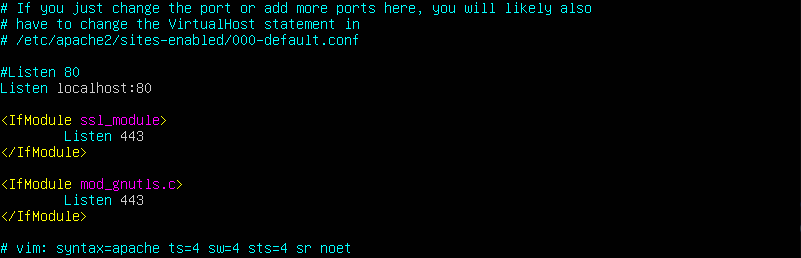
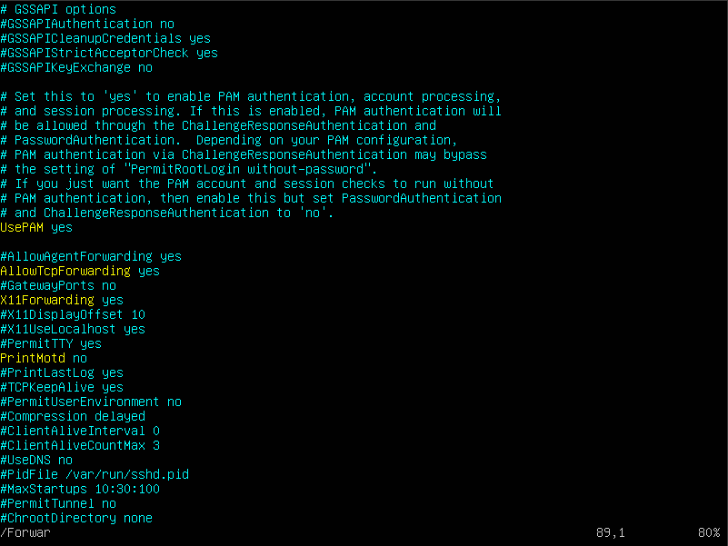
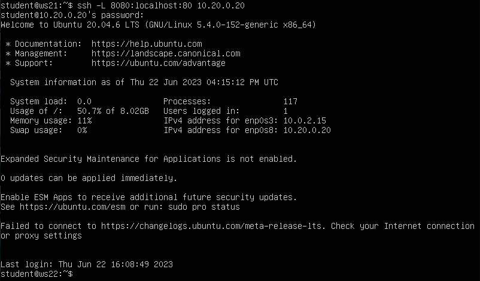
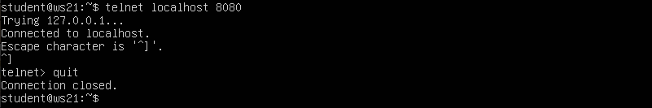
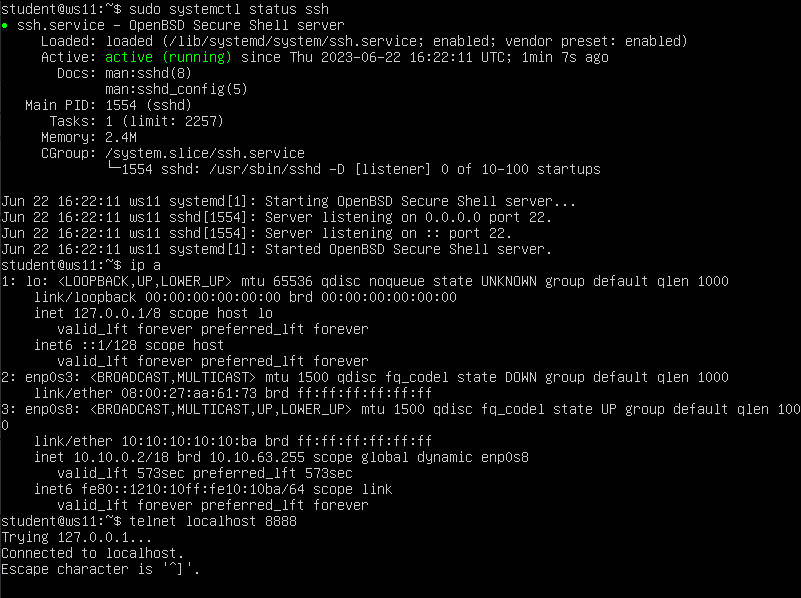
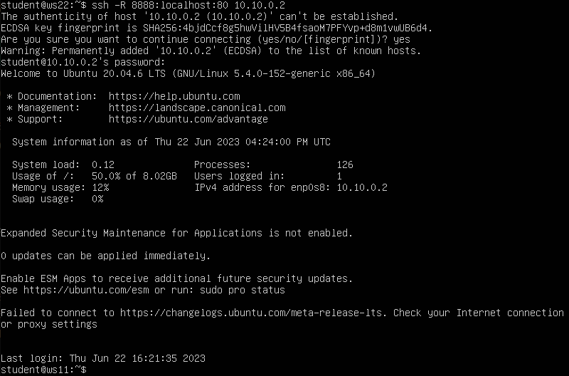

*Пробрасываем SSH туннели.*

- В отчёте описать команды, необходимые для выполнения этих четырёх пунктов, а также приложить скриншоты с их вызовом и выводом.

#### **Сохранить дампы образов виртуальных машин**
**p.s. Ни в коем случае не сохранять дампы в гит!**

## Chapter IV

💡 [Нажми тут](https://forms.yandex.ru/cloud/6418183eeb614624a5cee6b5/), **чтобы поделиться с нами обратной связью на этот проект**. Это анонимно и поможет команде Педаго сделать твоё обучение лучше.
